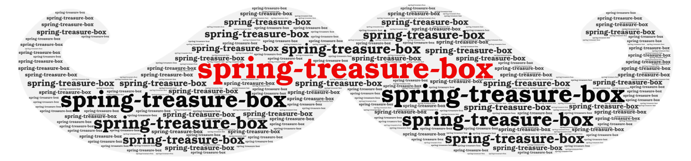

# spring-treasure-box 

一个汇总Spring相关整合其他技术框架的仓库，持续更新学习中.....

[简体中文](./README.md) | 英文 | 

# 缘由
太过零散的知识点不易记忆，且查找的时候也不是太方便，眼过千遍不如手过一遍的操作一遍，java开发使用Spring框架必不可少，即使Springboot已经很好的整合了各项的技术框架，但实际操作的时候也会发现一些问题。我会将可能出现的问题记录一下，每个模块匹配博文时刻更新。（核心原因：年纪大了，记不住东西）

## 仓库模块列表
* tao-spring-experience：spring学习库
* tao-springboot-pro：springboot学习库
* tao-springboot-activemq：springboot整合activemq
* tao-springboot-mybatis：springboot整合mybatis
* tao-springboot-redis：springboot整合redis
* tao-springboot-swagger2：springboot整合swagger2
* tao-springboot-shiro : springboot整合shiro
* tao-springboot-thymeleaf : springboot整合thymeleaf
* tao-springboot-mongodb : springboot整合mongodb

## 维护者
taojian

## 相关链接

## License

MIT
